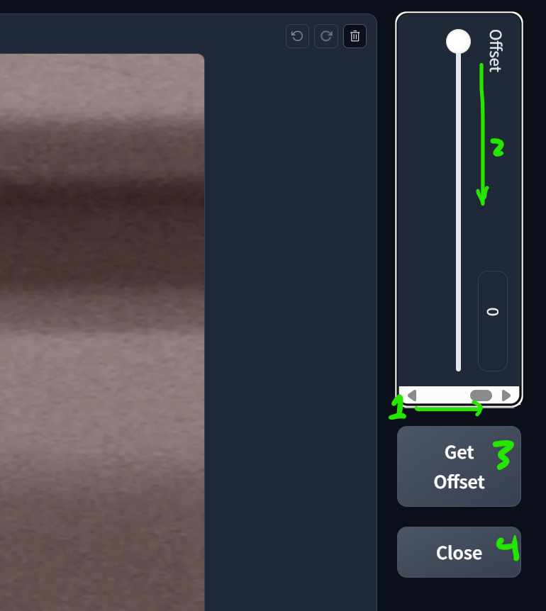
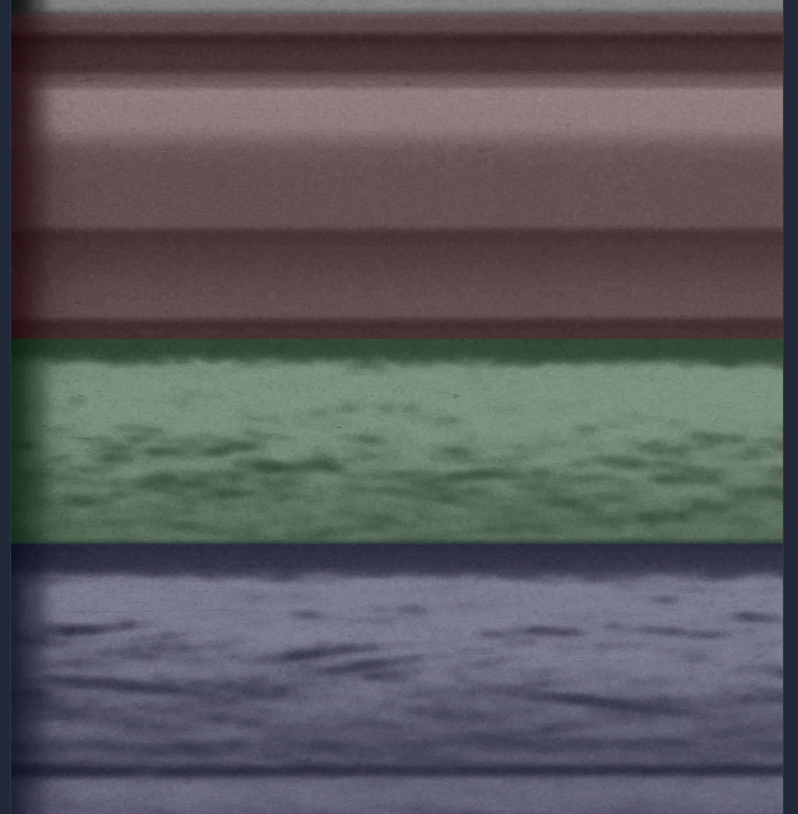
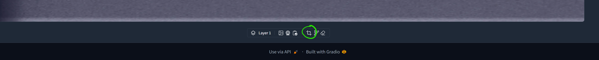
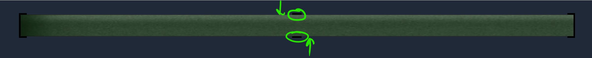
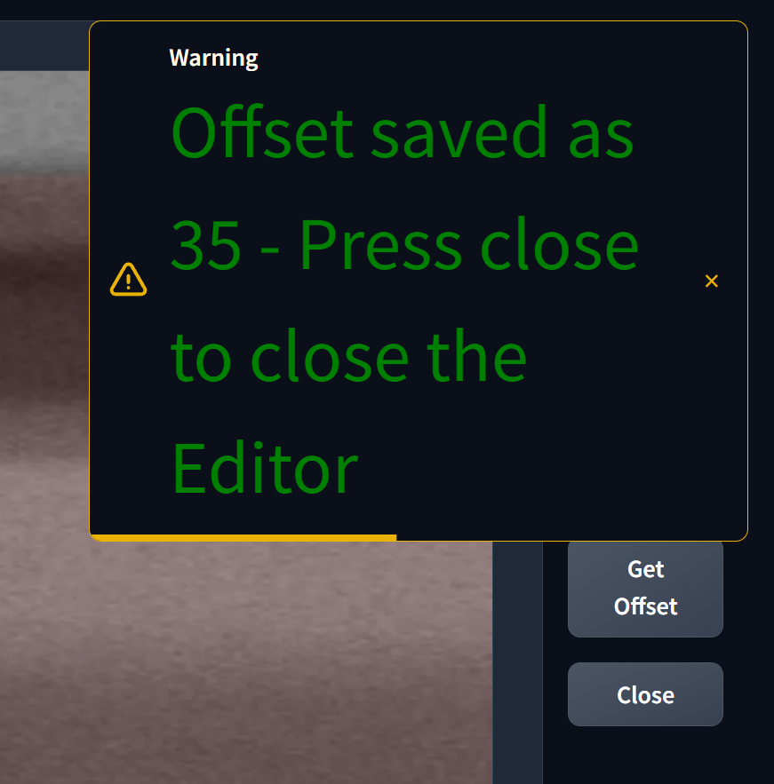
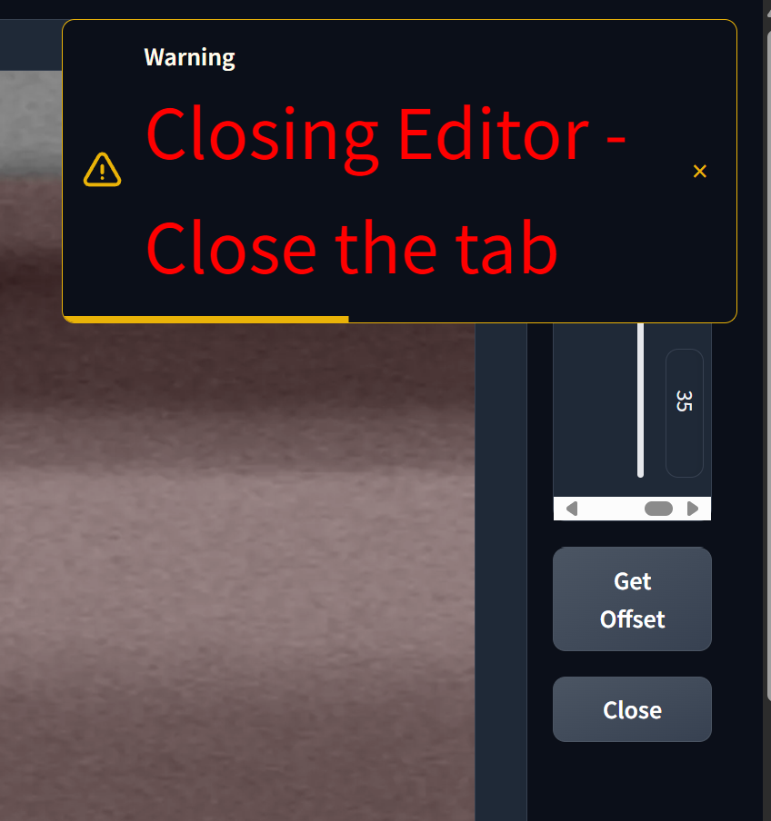

# Preprocess.py

## Function

preprocess.py aims to increase the user's ability to turn raw CSVs and TIFFs into a dataset usable for machine learning.
The data format needed by the algorithm is a 512x512px image and a 512x512px mask that represents the ground truth the algorithm is trying to derive from the image

- - -

There are 3 primary tasks that the script does:

1. **Matches Tiffs and CSVs**: The script automatically pairs up Tiffs with the CSVs containing their labels. It is designed to sift through the raw\_data/tiffs and raw\_data/csvs folder for matching pairs, reducing the user's workload. The script also adapts to any new data that is added to the folders, and intelligently skips already processed files to reduce compute time. This also allows for the quick resumption of progress after any errors.
2. **Sets offsets**: The most difficult part of creating the dataset is lining up the layers from the CSV data with the actual layers from the images. To speed up this process, a GUI was created. The code for the GUI is set in the set\_offset.py file.
3. **Creates Masks and Shards images**: Using the data from the matched CSVs, the program automatically interpolates between the points and creates masks from the bed heights in the CSV and the offsets. It also slices the Masks and Tiffs into Image Mask pairs that the ML algorithm can process.
4. **Creates a Huggingface Dataset**: The script stores the Image Mask pairs in a Huggingface dataset that is pushed to a private huggingface hub. This allows for the final dataset to be downloaded on many different machines and provides an easy interface for using the data during training.

## Usage

1. Copy all the CSVs from your new data to raw\_data/csvs, and all the Tiffs to raw\_data/tiffs. You do not need to ensure that the CSVs and Tiffs match up, as the program will find matching pairs automatically
2. Run preprocess.sh, or preprocess.ps1. These run preprocess.py for maximum performance
3. When the editor opens in the browser tab, there should be two columns, a large image with three colored layers, and a box at the top right with two buttons underneath it. The red layer is the sky, the green is the glacial bed, and the blue is the bedrock. There are two ways to adjust the offsets for the image.
1\. In the top right box\, scroll to the right until you see a slider\. Drag the slider or adjust the number to ensure the green matches the bed correctly\. The labels aren't precise\, and sometimes you must settle for the best fit\.
2\. Scroll to the very bottom of the page\. There\, you will see the crop button\. Crop the image so that the top of the green is the top margin of the image\, and wherever you want to adjust\, the green is the bottom edge\. The resulting smaller image's height is used as the offset\. This method is less precise and more finicky\, so it shouldn't be used as the primary method
Double check to make sure you have the correct offset and click the Get Offset button and wait till the popup has told you that you can close the editor. It definetly wouldn't hurt to double check the image to ensure that it looks correct at this stage. If it does, then click the close button and close the browser tab.
4. Repeat setting the offsets for each new Tiff/CSV pair.
5. Doublecheck that the dataset is uploaded to huggingface after the script is completed.

## Images:
#### What you see when the editor opens up

#### What the slider looks like

#### What a successfully set slider looks like

#### The result of the slider method

#### The Crop Method:

#### The Results of the Crop Method

#### The offset is recorded popup

#### Close the broser popup

